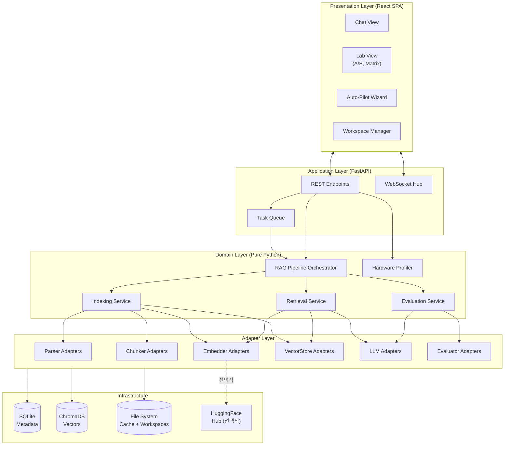
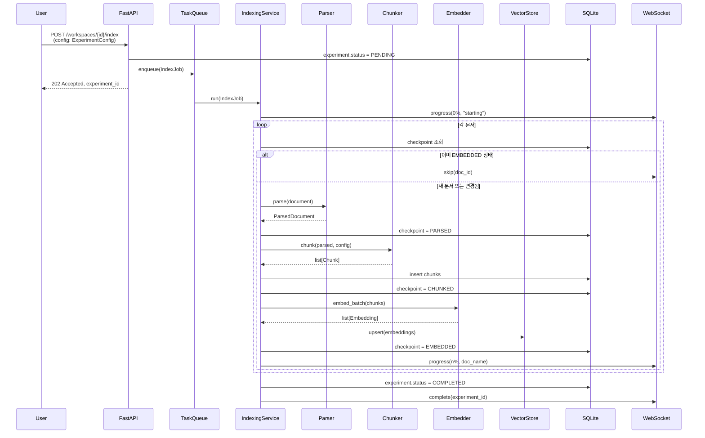
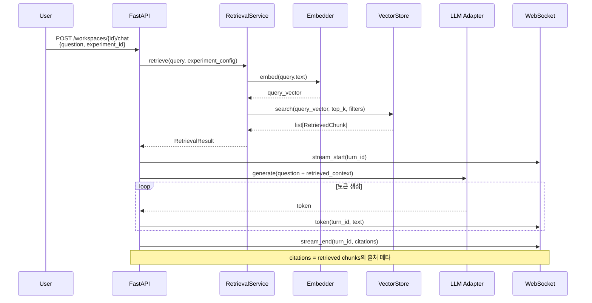
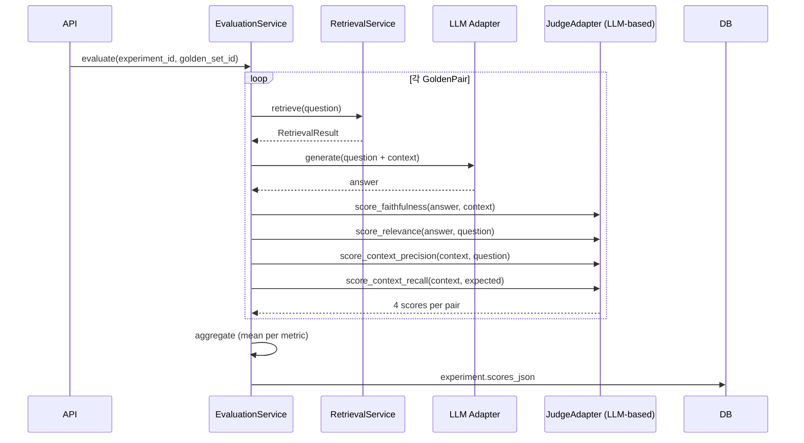
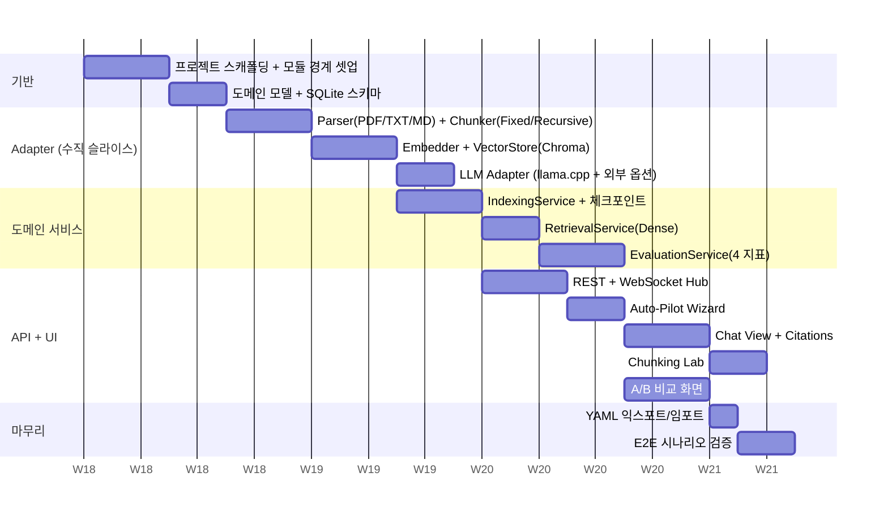

# OpenRAG-Lab 소프트웨어 설계 명세서 (SDD v3)

> **이 문서의 위치**: 컨셉 명세서(v4)에서 정의한 기능 요구사항을 **구현 가능한 구조**로 풀어낸 설계 문서.
> **짝 문서**: `PLATFORM.md` — OS별 차이의 단일 진실 공급원. OS·경로·GPU 백엔드 관련 결정은 PLATFORM.md가 우선.
> **독자**: Claude Code, 그리고 코드 리뷰어.
> **작성 원칙**:
> - 핵심 설계 결정은 그 **이유**와 함께 기술한다.
> - 외부 라이브러리는 **추천 조합**으로 명시하되, 어댑터 인터페이스로 격리하여 교체 가능하게 한다.
> - MVP(2-4주)에 들어갈 것과 그 이후를 분리한다.
> - OS별 차이는 PLATFORM.md를 참조하고, 도메인 코드는 OS를 알지 않는다.
> **변경 이력**:
> - v1→v2: §1에 OS 중립성 원칙 추가 / §2에 OS별 wheel 기준 명시 / §11.2 OS별 디렉토리 표준 / 곳곳에 PLATFORM.md 링크.
> - v2→v3: 검색 전용 모드 명시 / 외부 LLM 4종 어댑터 추가 / 임베딩 차원별 컬렉션 분리 / §13 모든 결정사항 확정 처리.

---

## 1. 핵심 설계 원칙

설계 전반을 관통하는 6가지 원칙. 충돌 시 위에서부터 우선한다.

1. **로컬 우선 (Local-first)**
   외부 네트워크 호출은 사용자가 명시적으로 허용한 경우에만, UI 상태 표시줄에 표시되는 채널을 통해서만 발생한다.

2. **어댑터로 격리 (Adapter-isolated)**
   임베딩, 벡터 저장소, 청킹, LLM, 평가자 등 교체 가능성이 있는 모든 외부 의존성은 어댑터 인터페이스 뒤에 둔다. 비즈니스 로직은 어댑터 인터페이스만 알고, 구체 구현체를 알지 않는다.

3. **결정적 재현 (Deterministic Replay)**
   동일 워크스페이스 + 동일 설정 YAML을 입력하면 동일한 인덱스와 동일한 평가 결과가 재현되어야 한다. 설정에 영향을 주는 모든 파라미터는 캐시 키와 실험 ID에 포함된다.

4. **취소 가능성 (Cancellable)**
   30초 이상 걸릴 수 있는 모든 작업(인덱싱, 평가, 모델 다운로드)은 사용자가 언제든 중단할 수 있어야 하고, 중단 후 재개 시 이미 처리된 부분은 건너뛴다.

5. **관찰 가능성 (Observable)**
   파이프라인의 모든 중간 산출물(청크, 임베딩 통계, 검색 결과, 평가 점수)은 UI 또는 워크스페이스 폴더에서 직접 확인할 수 있다.

6. **OS 중립 도메인 (OS-Neutral Domain)**
   도메인 코드는 OS를 알지 않는다. OS별 분기(경로 표준, GPU 백엔드, 파일 잠금 처리 등)는 모두 어댑터·infra 레이어에 격리되며, 그 정책은 `PLATFORM.md`에 단일하게 정의된다. macOS·Windows·Linux 세 OS는 1급 시민으로 동등 지원된다.

---

## 2. 추천 기술 스택

본 절은 어댑터의 **기본 구현체** 후보를 제시한다. 어댑터 인터페이스(§7)를 따르는 한 다른 라이브러리로 교체 가능하다.

| 영역 | 추천 | 선정 이유 |
|---|---|---|
| 백엔드 언어 | **Python 3.11+** | RAG/ML 생태계의 표준. 어댑터·평가 라이브러리 풍부. |
| 백엔드 웹 프레임워크 | **FastAPI** | 타입 힌트 기반 자동 문서화, 비동기 지원, MVP에 빠른 시작. |
| 비동기 작업 처리 | **asyncio + 자체 작업 큐** | 로컬 단일 프로세스 환경이라 Celery/Redis 불필요. 인덱싱은 백그라운드 태스크로 처리. |
| 벡터 저장소 (기본) | **ChromaDB** (임베디드 모드) | 외부 서버 불필요, 로컬 우선 원칙에 부합. |
| 벡터 저장소 (P2 옵션) | Qdrant, Milvus | 대용량/고성능 시 어댑터 교체로 대응. |
| 임베딩 (기본) | **sentence-transformers** + Hugging Face | 로컬 실행, 모델 풍부, GPU/CPU 자동 처리. |
| 청킹 | **자체 구현 + LangChain text_splitters 참조** | 의존성 최소화, 로직 단순. |
| 문서 파싱 | **PyMuPDF (PDF), markdown-it-py (MD), 표준 텍스트 처리** | MVP 범위(PDF/TXT/MD)에 충분. |
| 로컬 LLM | **llama.cpp (llama-cpp-python)** | GGUF 포맷, CPU/GPU 모두 지원. |
| 평가 | **자체 구현 (RAGAS 지표 정의 참조)** | RAGAS 의존성 무거움. 4개 지표는 자체 구현이 더 가볍고 투명. |
| 메타데이터 DB | **SQLite** | 단일 파일, 워크스페이스에 그대로 포함 가능. |
| 프런트엔드 | **React + Vite + TypeScript** | 컴포넌트 기반 UI, 타입 안전성. |
| 차트 | **Recharts** 또는 **Plotly** | 레이더·바·라인 차트 모두 지원. |
| 통신 | **REST + WebSocket** | REST는 일반 요청, WebSocket은 진행률·로그 스트리밍. |
| 패키징 | **uv** (Python) + **pnpm** (Node) | 빠른 설치, 락 파일 관리. |
| 단위 테스트 | **pytest, vitest** | 표준. |

> **주의**: 위 스택은 어댑터 인터페이스 뒤에 위치한다. 컨셉 문서에서 약속한 "확장 시 기존 코드 수정 불필요" 원칙을 위해, 비즈니스 로직 코드 어디에서도 위 라이브러리를 직접 import하지 않는다.
>
> **OS 호환**: 위 모든 라이브러리는 macOS · Windows · Linux 셋 모두에서 PyPI wheel을 제공해야 한다는 기준으로 선정되었다. 빌드가 필요한 라이브러리(`bitsandbytes`, `flash-attention` 등)는 일부 OS에서 동작하지 않으므로 MVP에서 사용하지 않는다. 상세 매트릭스는 `PLATFORM.md` §3.4, §6.2 참조.
>
> **GPU 가속**: 임베딩과 LLM은 어댑터에서 OS·GPU 환경에 맞는 백엔드를 선택한다 (CUDA / Metal / CPU 등). 도메인 코드는 백엔드 종류를 알지 않는다. 선택 로직은 `PLATFORM.md` §3 참조.

---

## 3. 시스템 아키텍처 (고수준)

### 3.1. 레이어 구조



### 3.2. 레이어 책임

| 레이어 | 책임 | 의존 방향 |
|---|---|---|
| **Presentation** | 사용자 입력 수집, 결과 시각화. 비즈니스 로직 없음. | Application만 호출 |
| **Application** | HTTP/WS 요청 ↔ 도메인 호출 변환, 작업 큐 관리, 인증(MVP에서는 단일 사용자 가정). | Domain만 호출 |
| **Domain** | RAG 파이프라인의 비즈니스 로직. 외부 라이브러리 직접 import 금지. | Adapter 인터페이스만 알고 있음 |
| **Adapter** | 외부 라이브러리 호출을 도메인 인터페이스로 감쌈. | Infrastructure 사용 |
| **Infrastructure** | DB, 파일 시스템, 외부 모델 허브. | 가장 바깥 |

**의존성 규칙**: 화살표는 항상 위에서 아래로만 흐른다. Domain 레이어가 Application이나 UI를 알게 하지 않는다.

---

## 4. 모듈/패키지 구조

```
openrag-lab/
├── backend/
│   ├── app/                           # Application Layer
│   │   ├── main.py                    # FastAPI 진입점
│   │   ├── api/
│   │   │   ├── workspaces.py          # /workspaces/*
│   │   │   ├── documents.py           # /workspaces/{id}/documents/*
│   │   │   ├── chunking.py            # /workspaces/{id}/chunking/preview
│   │   │   ├── indexing.py            # /workspaces/{id}/index
│   │   │   ├── chat.py                # /workspaces/{id}/chat
│   │   │   ├── experiments.py         # /workspaces/{id}/experiments/*
│   │   │   └── system.py              # /system/profile, /system/presets
│   │   ├── ws/
│   │   │   └── hub.py                 # WebSocket 진행률·로그 채널
│   │   └── tasks/
│   │       └── queue.py               # asyncio 기반 백그라운드 작업 큐
│   │
│   ├── domain/                        # Domain Layer (외부 라이브러리 import 금지)
│   │   ├── models/                    # 도메인 객체 (dataclass / pydantic)
│   │   │   ├── document.py            # Document, ParsedDocument
│   │   │   ├── chunk.py               # Chunk, ChunkSet
│   │   │   ├── embedding.py           # Embedding, EmbeddingBatch
│   │   │   ├── retrieval.py           # Query, RetrievedContext
│   │   │   ├── experiment.py          # ExperimentConfig, ExperimentResult
│   │   │   └── workspace.py           # Workspace, WorkspaceMeta
│   │   ├── services/
│   │   │   ├── pipeline.py            # RAGPipeline (오케스트레이터)
│   │   │   ├── indexer.py             # IndexingService
│   │   │   ├── retriever.py           # RetrievalService
│   │   │   ├── evaluator.py           # EvaluationService (4개 지표)
│   │   │   ├── golden_set.py          # GoldenSetService
│   │   │   ├── profiler.py            # HardwareProfiler
│   │   │   └── presets.py             # PresetRecommender
│   │   ├── ports/                     # 어댑터 인터페이스 (Protocol/ABC)
│   │   │   ├── parser.py
│   │   │   ├── chunker.py
│   │   │   ├── embedder.py
│   │   │   ├── vector_store.py
│   │   │   ├── llm.py
│   │   │   └── evaluator_judge.py
│   │   └── errors.py                  # 도메인 예외 계층
│   │
│   ├── adapters/                      # Adapter Layer
│   │   ├── parsers/
│   │   │   ├── pdf_pymupdf.py
│   │   │   ├── txt.py
│   │   │   └── markdown.py
│   │   ├── chunkers/
│   │   │   ├── fixed.py
│   │   │   ├── recursive.py
│   │   │   └── semantic.py            # P1
│   │   ├── embedders/
│   │   │   └── sentence_transformers.py
│   │   ├── vector_stores/
│   │   │   └── chroma.py
│   │   ├── llms/
│   │   │   ├── llama_cpp.py              # 로컬 LLM (P0)
│   │   │   ├── _base_external.py         # 외부 LLM 공통 베이스 (P1)
│   │   │   ├── openai.py                 # P1
│   │   │   ├── anthropic.py              # P1
│   │   │   ├── gemini.py                 # P1
│   │   │   └── openrouter.py             # P1
│   │   └── evaluators/
│   │       └── llm_judge.py           # LLM 기반 4개 지표 산출
│   │
│   ├── infra/                         # Infrastructure
│   │   ├── db/
│   │   │   ├── sqlite.py              # 연결, 마이그레이션
│   │   │   └── repositories/
│   │   │       ├── workspace_repo.py
│   │   │       ├── experiment_repo.py
│   │   │       └── golden_set_repo.py
│   │   ├── cache/
│   │   │   ├── embedding_cache.py     # 키: hash(doc_id, model_id, chunk_cfg)
│   │   │   └── parse_cache.py
│   │   ├── fs/
│   │   │   └── workspace_layout.py    # 워크스페이스 디렉토리 구조 관리
│   │   ├── hardware/
│   │   │   └── probe.py               # CPU/RAM/GPU 탐지
│   │   ├── secrets/                   # P1
│   │   │   └── keystore.py            # 외부 LLM API 키 저장 (settings.yaml + chmod 600)
│   │   └── external/                  # P1
│   │       └── http_client.py         # 외부 호출 단일 게이트웨이, WS 이벤트 발행
│   │
│   ├── config/
│   │   ├── settings.py                # 앱 설정 (환경변수)
│   │   └── yaml_io.py                 # 워크스페이스 설정 YAML 입출력
│   │
│   └── tests/
│       ├── unit/
│       ├── integration/
│       └── fixtures/
│
├── frontend/
│   ├── src/
│   │   ├── views/
│   │   │   ├── AutoPilotWizard.tsx
│   │   │   ├── ChatView.tsx
│   │   │   ├── ChunkingLab.tsx
│   │   │   ├── ExperimentMatrix.tsx
│   │   │   └── ExperimentResults.tsx
│   │   ├── components/                # 재사용 UI
│   │   ├── api/                       # REST 클라이언트 + WebSocket 훅
│   │   ├── store/                     # 전역 상태 (Zustand 권장)
│   │   └── types/                     # 백엔드와 공유하는 타입 (OpenAPI 생성)
│   └── tests/
│
├── workspaces/                         # 사용자 워크스페이스 루트 (런타임 생성)
│   └── <workspace_id>/
│       ├── meta.sqlite
│       ├── config.yaml
│       ├── documents/                  # 원본 또는 링크
│       ├── cache/
│       │   ├── parsed/
│       │   └── embeddings/
│       ├── vectors/                    # ChromaDB 데이터
│       └── experiments/
│           └── <experiment_id>/
│               ├── config_snapshot.yaml
│               ├── scores.json
│               └── traces.jsonl
│
├── docs/
│   ├── concept_v2.md                   # 컨셉 명세서
│   └── design_v1.md                    # 본 문서
│
└── scripts/
    └── dev.sh                          # 개발 환경 실행
```

### 4.1. 의존성 방향 강제

`domain/` 디렉토리 내부 어떤 파일도 다음을 import해서는 안 된다:

- 외부 라이브러리 (sentence-transformers, chromadb, llama_cpp 등)
- `adapters/`, `infra/`, `app/`

이 규칙은 import-linter 또는 ruff의 모듈 경계 룰로 자동 검증한다.

---

## 5. 데이터 모델

핵심 도메인 객체만 기술. 모든 객체는 immutable(`frozen=True`)을 기본으로 한다.

### 5.1. 핵심 객체

```python
# domain/models/document.py
@dataclass(frozen=True)
class Document:
    id: DocumentId                # 워크스페이스 내 유일
    workspace_id: WorkspaceId
    source_path: Path             # 원본 경로
    content_hash: str             # SHA-256, 캐시 키 구성
    format: DocumentFormat        # PDF | TXT | MD | ...
    size_bytes: int
    added_at: datetime

@dataclass(frozen=True)
class ParsedDocument:
    document_id: DocumentId
    pages: list[ParsedPage]       # 페이지 단위 텍스트 + 메타데이터
    parser_version: str           # 캐시 무효화용

# domain/models/chunk.py
@dataclass(frozen=True)
class ChunkingConfig:
    strategy: ChunkingStrategy    # FIXED | RECURSIVE | SENTENCE | SEMANTIC
    chunk_size: int
    chunk_overlap: int
    extra: dict[str, Any] = field(default_factory=dict)  # 전략별 추가 파라미터

    def cache_key(self) -> str:   # 결정적 직렬화
        ...

@dataclass(frozen=True)
class Chunk:
    id: ChunkId
    document_id: DocumentId
    content: str
    token_count: int
    metadata: ChunkMetadata        # 페이지, 섹션, 문서 내 위치 등
    chunk_config_key: str          # 어떤 설정으로 만들어졌는지

# domain/models/embedding.py
@dataclass(frozen=True)
class Embedding:
    chunk_id: ChunkId
    vector: np.ndarray
    model_id: str
    model_version: str
    created_at: datetime

# domain/models/retrieval.py
@dataclass(frozen=True)
class Query:
    text: str
    top_k: int = 5
    filters: dict[str, Any] = field(default_factory=dict)

@dataclass(frozen=True)
class RetrievedChunk:
    chunk: Chunk
    score: float
    rank: int

@dataclass(frozen=True)
class RetrievalResult:
    query: Query
    retrieved: list[RetrievedChunk]
    strategy: RetrievalStrategy   # DENSE | SPARSE | HYBRID
    latency_ms: int

# domain/models/experiment.py
@dataclass(frozen=True)
class ExperimentConfig:
    embedder_id: str
    chunking: ChunkingConfig
    retrieval_strategy: RetrievalStrategy
    top_k: int
    reranker_id: str | None = None
    llm_id: str | None = None              # None이면 검색 전용 모드
    judge_llm_id: str | None = None        # 평가용 LLM. None이면 llm_id 사용

    @property
    def is_retrieval_only(self) -> bool:
        """LLM 미지정 시 검색 전용 모드. 답변 생성·일부 평가 지표 생략."""
        return self.llm_id is None

    def fingerprint(self) -> str:  # 결정적 해시 — 캐시·재현 키
        ...

@dataclass(frozen=True)
class ExperimentResult:
    experiment_id: ExperimentId
    workspace_id: WorkspaceId
    config: ExperimentConfig
    scores: EvaluationScores      # 검색 전용 모드면 LLM 의존 지표는 None
    profile: PerformanceProfile   # 단계별 latency, memory
    completed_at: datetime
    archived: bool = False        # 임베더 차원 변경 후에도 보존되는 이전 결과
```

### 5.2. SQLite 스키마 (핵심 테이블만)

```sql
CREATE TABLE workspace (
    id TEXT PRIMARY KEY,
    name TEXT NOT NULL,
    created_at TEXT NOT NULL,
    config_yaml_path TEXT
);

CREATE TABLE document (
    id TEXT PRIMARY KEY,
    workspace_id TEXT NOT NULL REFERENCES workspace(id) ON DELETE CASCADE,
    source_path TEXT NOT NULL,
    content_hash TEXT NOT NULL,
    format TEXT NOT NULL,
    size_bytes INTEGER NOT NULL,
    added_at TEXT NOT NULL,
    UNIQUE(workspace_id, content_hash)
);

CREATE TABLE chunk (
    id TEXT PRIMARY KEY,
    document_id TEXT NOT NULL REFERENCES document(id) ON DELETE CASCADE,
    chunk_config_key TEXT NOT NULL,
    sequence INTEGER NOT NULL,
    content TEXT NOT NULL,
    token_count INTEGER NOT NULL,
    metadata_json TEXT NOT NULL
);
CREATE INDEX idx_chunk_doc_cfg ON chunk(document_id, chunk_config_key);

CREATE TABLE experiment (
    id TEXT PRIMARY KEY,
    workspace_id TEXT NOT NULL REFERENCES workspace(id) ON DELETE CASCADE,
    config_fingerprint TEXT NOT NULL,
    config_yaml TEXT NOT NULL,
    status TEXT NOT NULL,         -- PENDING | RUNNING | COMPLETED | FAILED | CANCELLED
    started_at TEXT NOT NULL,
    completed_at TEXT,
    scores_json TEXT,
    profile_json TEXT
);

CREATE TABLE golden_set (
    id TEXT PRIMARY KEY,
    workspace_id TEXT NOT NULL REFERENCES workspace(id) ON DELETE CASCADE,
    name TEXT NOT NULL
);

CREATE TABLE golden_pair (
    id TEXT PRIMARY KEY,
    golden_set_id TEXT NOT NULL REFERENCES golden_set(id) ON DELETE CASCADE,
    question TEXT NOT NULL,
    expected_answer TEXT,
    expected_chunk_ids TEXT       -- JSON array, optional
);

CREATE TABLE indexing_checkpoint (
    workspace_id TEXT NOT NULL,
    document_id TEXT NOT NULL,
    config_fingerprint TEXT NOT NULL,
    status TEXT NOT NULL,         -- PARSED | CHUNKED | EMBEDDED
    updated_at TEXT NOT NULL,
    PRIMARY KEY (workspace_id, document_id, config_fingerprint)
);
```

벡터 자체는 ChromaDB에 저장하고, SQLite에는 메타만 둔다.

---

## 6. 데이터 플로우 (시퀀스)

### 6.1. 인덱싱 시퀀스



**핵심 포인트**:
- 각 단계 완료마다 체크포인트 갱신 → 중단 후 재개 시 PARSED, CHUNKED 상태에서 이어서 진행.
- 임베딩은 캐시 키(`doc.content_hash + model_id + chunk_config.cache_key`)로 조회. 동일 키 존재 시 재계산 생략.
- 진행률은 WebSocket으로 스트리밍, REST 폴링 불필요.

### 6.2. 검색·답변 시퀀스



### 6.3. 평가 시퀀스 (정량 지표)



---

## 7. 주요 인터페이스 (어댑터 시그니처)

모든 어댑터는 Python `Protocol` 또는 `ABC`로 정의한다. 도메인 코드는 이 인터페이스만 알며, 구체 클래스는 의존성 주입(DI)으로 주입된다.

### 7.1. Parser

```python
class DocumentParser(Protocol):
    """원본 문서를 텍스트 + 페이지/섹션 메타데이터로 변환."""

    def supports(self, format: DocumentFormat) -> bool: ...

    async def parse(self, document: Document) -> ParsedDocument:
        """
        예외:
          - ParseError: 파일 손상, 암호화 등 복구 불가능한 실패
        """
        ...

    @property
    def parser_version(self) -> str:
        """캐시 무효화용. 파서 로직 변경 시 증가."""
        ...
```

### 7.2. Chunker

```python
class Chunker(Protocol):
    """ParsedDocument → list[Chunk]."""

    @property
    def strategy(self) -> ChunkingStrategy: ...

    async def chunk(
        self,
        parsed: ParsedDocument,
        config: ChunkingConfig,
    ) -> list[Chunk]: ...

    async def preview(
        self,
        text: str,
        config: ChunkingConfig,
        max_chunks: int = 50,
    ) -> list[ChunkPreview]:
        """청킹 실험실용 빠른 미리보기. 색상 구간 정보 포함."""
        ...
```

### 7.3. Embedder

```python
class Embedder(Protocol):
    """텍스트 → 벡터."""

    @property
    def model_id(self) -> str: ...
    @property
    def dim(self) -> int: ...
    @property
    def max_tokens(self) -> int: ...
    @property
    def active_backend(self) -> AccelBackend:
        """현재 사용 중인 가속 백엔드 (CUDA, METAL, CPU 등).
        선택 로직은 PLATFORM.md §3.3 참조."""
        ...

    async def embed_query(self, text: str) -> np.ndarray: ...

    async def embed_documents(
        self,
        texts: list[str],
        progress: ProgressCallback | None = None,
    ) -> list[np.ndarray]:
        """
        진행률 콜백을 통해 배치 단위 진행 상황 보고.
        예외:
          - ModelNotLoadedError, OutOfMemoryError, BackendUnavailableError
        """
        ...
```

### 7.4. VectorStore

```python
class VectorStore(Protocol):
    """벡터 + 메타데이터 저장소."""

    async def create_collection(
        self, name: str, dim: int, metric: DistanceMetric
    ) -> None: ...

    async def upsert(
        self, collection: str, items: list[VectorItem]
    ) -> None: ...

    async def search(
        self,
        collection: str,
        query_vector: np.ndarray,
        top_k: int,
        filters: dict[str, Any] | None = None,
    ) -> list[VectorHit]: ...

    async def delete(self, collection: str, ids: list[str]) -> None: ...

    async def stats(self, collection: str) -> CollectionStats: ...
```

### 7.5. LLM

```python
class LLM(Protocol):
    """답변 생성. 로컬 또는 외부 API."""

    @property
    def model_id(self) -> str: ...
    @property
    def is_local(self) -> bool: ...   # False면 외부 호출 — UI에 표시
    @property
    def active_backend(self) -> AccelBackend | None:
        """로컬 LLM의 가속 백엔드 (CUDA, METAL, CPU). 외부 API면 None.
        PLATFORM.md §3.3 참조."""
        ...

    async def generate(
        self,
        prompt: str,
        max_tokens: int = 512,
        temperature: float = 0.0,
    ) -> str: ...

    async def stream(
        self,
        prompt: str,
        max_tokens: int = 512,
        temperature: float = 0.0,
    ) -> AsyncIterator[str]:
        """토큰 단위 스트리밍."""
        ...
```

### 7.6. EvaluatorJudge

```python
class EvaluatorJudge(Protocol):
    """4개 지표를 산출하는 LLM 기반 평가자."""

    async def score_faithfulness(
        self, answer: str, context: list[str]
    ) -> Score: ...

    async def score_answer_relevance(
        self, answer: str, question: str
    ) -> Score: ...

    async def score_context_precision(
        self, question: str, context: list[str]
    ) -> Score: ...

    async def score_context_recall(
        self, expected_answer: str, context: list[str]
    ) -> Score: ...
```

`Score`는 `value: float [0,1]`과 `rationale: str` (왜 그 점수인지 LLM의 설명)을 포함한다 — 컨셉 문서의 "산출 근거 클릭으로 확인" 요구사항을 만족.

---

## 8. 상태 관리 및 동시성

### 8.1. 백엔드: 작업 큐

MVP는 단일 사용자·단일 머신을 가정하므로 분산 큐(Celery, RQ) 대신 **asyncio 기반 자체 큐**를 사용한다.

```python
class TaskQueue:
    def __init__(self, max_concurrent: int = 1):
        self._semaphore = asyncio.Semaphore(max_concurrent)
        self._tasks: dict[TaskId, TaskHandle] = {}

    async def enqueue(self, job: Job) -> TaskId: ...
    async def cancel(self, task_id: TaskId) -> None: ...
    def status(self, task_id: TaskId) -> TaskStatus: ...
```

**동시성 정책**:
- 인덱싱: 동시 1개. 같은 워크스페이스에 두 인덱싱이 동시 진행되면 SQLite 체크포인트와 ChromaDB 쓰기가 충돌하므로.
- 검색·채팅: 동시 다수 가능. 읽기 전용.
- 평가: 동시 1개. 자원 소모가 큼.

**취소 메커니즘**:
- 모든 장기 작업은 `CancellationToken`을 전달받고, 단계 사이마다 `token.raise_if_cancelled()`를 호출.
- 취소 시 SQLite 체크포인트는 보존하여 재개 가능.

### 8.2. 프런트엔드 상태

전역 상태는 도메인별로 분리한 슬라이스로 관리한다 (Zustand 권장).

```
useWorkspaceStore     # 현재 워크스페이스, 문서 목록
useExperimentStore    # 실행 중·완료된 실험 목록, 진행률
useChatStore          # 채팅 턴, 스트리밍 토큰
useSystemStore        # 하드웨어 프로파일, 프리셋
```

**WebSocket 메시지 흐름**:
- 백엔드는 `topic`(experiment_id, chat_turn_id) 단위로 메시지를 발행.
- 프런트는 관심 있는 topic만 구독.
- 메시지 종류: `progress`, `log`, `token`, `error`, `complete`.

### 8.3. 캐시 일관성

캐시 키는 다음 속성을 기준으로 결정한다.

| 캐시 종류 | 키 구성 |
|---|---|
| 파싱 결과 | `document.content_hash + parser_version` |
| 청크 | `document.content_hash + parser_version + chunking_config.cache_key()` |
| 임베딩 | `chunk.id + embedder.model_id + embedder.model_version` |

설정 변경 시 영향받는 캐시만 무효화되도록 키를 좁게 잡는다. 예: 청킹 설정만 바꾸면 임베딩 캐시는 새로 계산되지만 파싱 캐시는 재사용.

---

## 9. 에러 처리 전략

### 9.1. 도메인 예외 계층

```python
class OpenRagError(Exception):
    """모든 도메인 예외의 루트."""
    user_message: str   # 사용자에게 보여줄 메시지
    technical: str      # 로그용
    recoverable: bool   # 재시도 가능 여부

class ParseError(OpenRagError): ...
class ModelNotLoadedError(OpenRagError): ...
class OutOfMemoryError(OpenRagError): ...
class CancelledError(OpenRagError): ...
class ConfigurationError(OpenRagError): ...
class ExternalApiError(OpenRagError):
    """외부 LLM/모델 허브 호출 실패."""
```

### 9.2. 처리 원칙

1. **도메인은 기술 예외를 도메인 예외로 변환한다.**
   어댑터 내부에서 발생한 라이브러리 예외는 어댑터가 받아 도메인 예외로 변환한 뒤 재던진다. 도메인 코드는 외부 라이브러리 예외를 알아서는 안 된다.

2. **사용자 메시지는 항상 한 단계 위에서 결정된다.**
   도메인 예외의 `user_message`는 기본값을 가지며, Application 레이어가 컨텍스트에 맞게 보완한다.

3. **부분 실패는 전체 실패가 아니다.**
   인덱싱 중 한 문서가 ParseError를 일으켜도 전체 작업은 멈추지 않는다. 실패 문서는 별도 리스트로 보고하고 나머지를 계속 처리한다.

4. **외부 호출은 명시적 재시도 정책을 가진다.**
   - 모델 다운로드: 3회 재시도, 지수 백오프.
   - 외부 LLM API: 사용자가 정한 횟수만큼.
   - 로컬 호출은 기본적으로 재시도하지 않는다.

5. **모든 예외는 구조화된 형태로 로깅한다.**
   `experiment_id`, `workspace_id`, `task_id`를 컨텍스트에 포함하여 추적 가능.

### 9.3. 에러 → UI 매핑

```
도메인 예외
   ↓ Application Layer가 변환
HTTP 응답 (400/500 + error_code + user_message)
   ↓ 프런트엔드 인터셉터가 처리
토스트 알림 또는 인라인 에러 표시
```

`error_code`는 안정된 식별자(예: `PARSE_ENCRYPTED_PDF`)로, 프런트가 코드별로 다른 UI 처리를 할 수 있게 한다.

---

## 10. 테스트 전략

### 10.1. 테스트 피라미드

| 레이어 | 비중 | 도구 | 비고 |
|---|---|---|---|
| 단위 (Domain) | 60% | pytest | 외부 의존성 없음. Adapter는 fake로 대체. |
| 통합 (Adapter) | 25% | pytest | 실제 라이브러리와 연동. 임베딩은 작은 모델로. |
| API | 10% | pytest + httpx | FastAPI TestClient. |
| E2E | 5% | Playwright | 핵심 시나리오 3개만. |

### 10.2. 핵심 테스트 케이스 (MVP)

**Domain 단위 테스트**:
- `RAGPipeline`: 모든 Adapter를 fake로 주입했을 때 인덱싱 → 검색 → 평가가 끝나는지.
- `IndexingService`: 체크포인트 재개 시 PARSED 단계부터 정확히 이어지는지.
- `ChunkingConfig.cache_key()`: 동일 설정이 동일 키를, 다른 설정이 다른 키를 생성하는지.
- `EvaluationService`: 4개 지표가 0~1 범위로 산출되는지, rationale이 비어 있지 않은지.

**Adapter 통합 테스트**:
- `PdfPyMuPdfParser`: 다국어·표 포함 샘플 PDF에서 텍스트가 추출되는지.
- `ChromaVectorStore`: upsert → search 라운드트립이 동일 ID를 반환하는지.
- `SentenceTransformersEmbedder`: 동일 텍스트가 여러 호출에서 동일 벡터를 내는지(결정성).

**API 테스트**:
- 인덱싱 중 cancel 호출 → 작업이 즉시 종료되고 status가 CANCELLED로 바뀌는지.
- 같은 YAML 두 번 import → 두 번째는 캐시 히트로 빠르게 끝나는지.

**E2E 시나리오 (P1로 미뤄도 됨)**:
1. Auto-Pilot: PDF 업로드 → 인덱싱 → 채팅 답변까지.
2. Lab Mode A/B: 두 청크 크기로 인덱싱 → 평가 → 차트 비교.
3. YAML 익스포트 → 빈 워크스페이스에 import → 동일 검색 결과.

### 10.3. 테스트 데이터

`backend/tests/fixtures/` 하위에 고정 샘플을 둔다.
- `sample_short.pdf`: 1페이지, 영문, 단순 텍스트.
- `sample_korean.pdf`: 다페이지 한글 + 표.
- `golden_set_small.json`: 5쌍의 평가용 질문-답변.

E2E 환경에서는 GPU 없이 돌릴 수 있도록 작은 임베딩 모델(예: `all-MiniLM-L6-v2`)과 작은 LLM(예: 1B 이하 GGUF)을 기본값으로.

---

## 11. 배포·실행 구조

### 11.1. 실행 모드

```
[Mode 1: Dev]     uvicorn (백엔드) + vite (프런트), 두 프로세스
[Mode 2: Bundle]  단일 명령으로 정적 프런트를 FastAPI가 서빙 (MVP 권장 배포)
[Mode 3: Docker]  컨테이너 1개에 백엔드 + 정적 프런트 (P2)
```

### 11.2. 디렉토리 표준

OS별 표준 경로를 따른다. 상세는 `PLATFORM.md` §2 참조.

| OS | 사용자 데이터 루트 |
|---|---|
| macOS | `~/Library/Application Support/OpenRAG-Lab/` |
| Windows | `%APPDATA%\OpenRAG-Lab\` |
| Linux | `$XDG_DATA_HOME/openrag-lab/` (없으면 `~/.local/share/openrag-lab/`) |

루트 아래 구조는 OS 무관하게 동일:

```
<루트>/
├── workspaces/             # 워크스페이스 루트
├── models/                 # 다운로드한 모델 캐시
├── logs/                   # 로그 파일
├── settings.yaml           # 글로벌 설정
└── runtime.lock            # 단일 인스턴스 보장
```

`OPENRAG_HOME` 환경변수로 위치 재정의 가능.

### 11.3. 단일 명령 실행

```bash
# 설치 후 (세 OS 공통)
openrag-lab serve   # 백엔드 + 프런트를 단일 포트로 서빙, 브라우저 자동 오픈
openrag-lab cli ... # 헤드리스 인덱싱·평가 (P1)
```

Windows에서는 `openrag-lab.exe serve`. 두 인스턴스 동시 실행 방지는 `runtime.lock` (PLATFORM.md §5.4).

### 11.4. 모델 캐시 정책

- 모델은 처음 사용 시 §11.2 루트의 `models/` 하위에 다운로드.
- 한도 초과 시 가장 오래 사용 안 한 모델부터 LRU로 정리.
- 한도와 정리 정책은 `settings.yaml`로 노출.

---

## 12. MVP 구현 순서 (2-4주 권장 경로)



이 순서의 핵심은 **수직 슬라이스 우선**이다: 한 어댑터 군을 끝까지(parser → chunker → embedder) 완성한 후 도메인 서비스를 붙여, 1주차 끝에는 빈약하더라도 인덱싱-검색이 한 번 돌아가게 한다.

---

## 13. 결정 사항 (Decisions Log)

컨셉 §9·§10의 결정사항이 모두 v3 기준 확정되었다. 본 절은 설계 관점의 상세를 기록한다.

1. ~~외부 LLM API 허용 여부~~ → **결정됨 (v3)**:
   - 4개 제공자 (OpenRouter, Gemini, OpenAI, Anthropic) 어댑터를 P1로 추가.
   - `adapters/llms/_base_external.py` 베이스 클래스: 키 등록 확인 → 키 없으면 `EXTERNAL_API_KEY_NOT_REGISTERED` 발생, 자동 다운로드·자동 진행 금지.
   - `infra/secrets/keystore.py`: 글로벌 settings.yaml에 `chmod 600`으로 키 저장. OS별 secure storage(Keychain, Credential Manager 등)는 P2.
   - `infra/external/http_client.py`: 외부 호출의 단일 게이트웨이. 모든 호출 시 WebSocket으로 `external_call` 이벤트 발행.

2. ~~타깃 OS 우선순위~~ → **결정됨 (v2)**: macOS · Windows · Linux 동등 지원. 상세 정책은 `PLATFORM.md` §1.

3. ~~GPU 미보유 시 동작~~ → **결정됨 (v2)**: CPU 모드로 자동 fallback. 백엔드 선택은 `PLATFORM.md` §3.3.

4. ~~임베딩 차원 변경 시 재인덱싱 정책~~ → **결정됨 (v3)**:
   - **벡터 격리**: ChromaDB 컬렉션 명을 `vectors_<embedder_id_short>_<dim>`로 구성하여 차원별로 자동 분리.
   - **이전 실험 보존**: 임베더 변경 시 기존 실험은 `archived: true`로 마크하고 컬렉션은 유지. 사용자가 다른 임베더의 실험과 점수 비교 가능.
   - **명시적 동의**: API에서 임베더 변경 감지 시 `requires_reindex_with_consent: true` 플래그를 응답에 포함. 프런트는 모달로 사용자 동의를 받은 뒤 `/index` 호출.
   - 영향 모듈: `adapters/vector_stores/chroma.py`, `domain/services/indexer.py`, `infra/db/repositories/experiment_repo.py`.

5. **워크스페이스 간 데이터 공유 여부**.
   같은 모델·같은 문서가 다른 워크스페이스에 있을 때 임베딩 캐시를 공유할지. **기본 제안 유지: 공유하지 않음** (격리 원칙). 다만 모델 캐시 디렉토리(`<OPENRAG_HOME>/models/`)는 공유 (`PLATFORM.md` §2.2). 이 결정은 P1에서 사용자 피드백 보고 재검토.

6. ~~MVP에서 LLM 응답 생성을 어디까지 보장할지~~ → **결정됨 (v3)**:
   - **검색 전용 모드를 1급 기능으로 P0 포함**.
   - `ExperimentConfig.is_retrieval_only` 속성이 도메인 전반의 분기점. `RAGPipeline`은 `is_retrieval_only`일 때 LLM 호출 단계를 생략하고, `EvaluationService`는 LLM 의존 지표(Faithfulness, Answer Relevance)를 `None`으로 반환.
   - UI는 검색 전용 모드 배지를 채팅·실험 상세에 표시.
   - 영향 모듈: `domain/services/pipeline.py`, `domain/services/evaluator.py`, `app/api/chat.py`.
